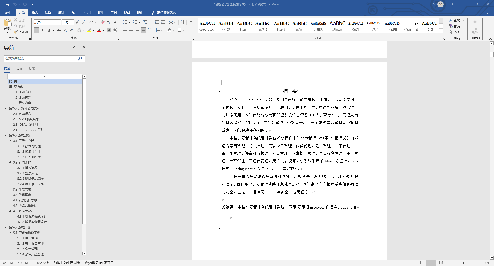
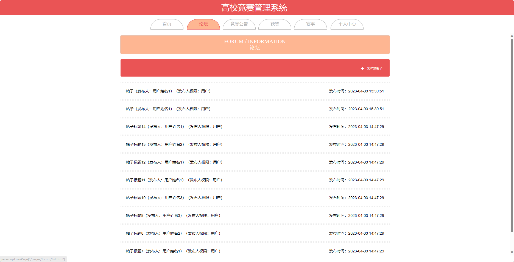
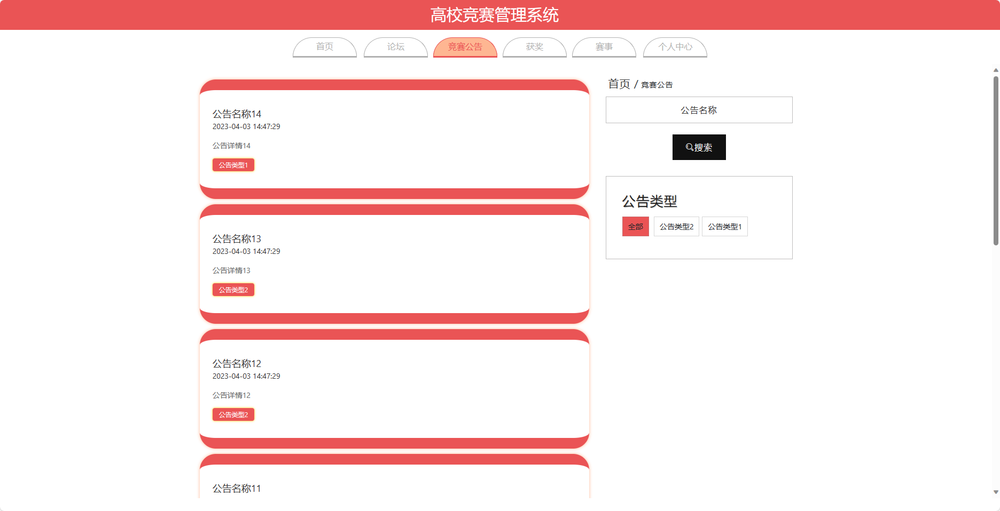
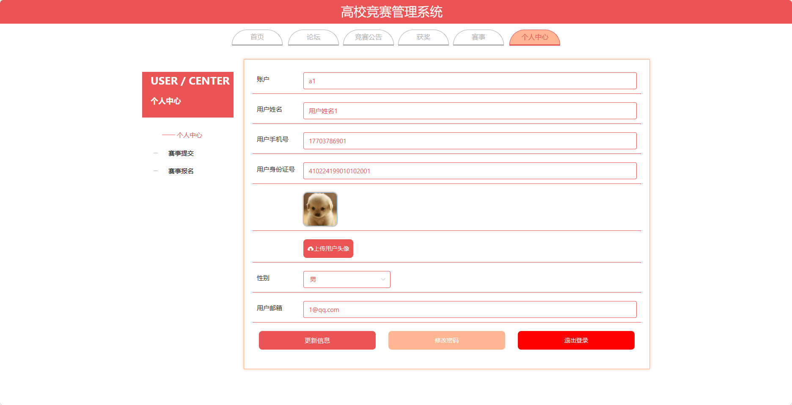
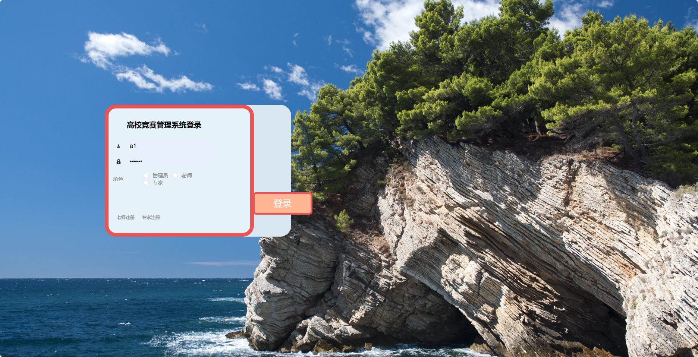
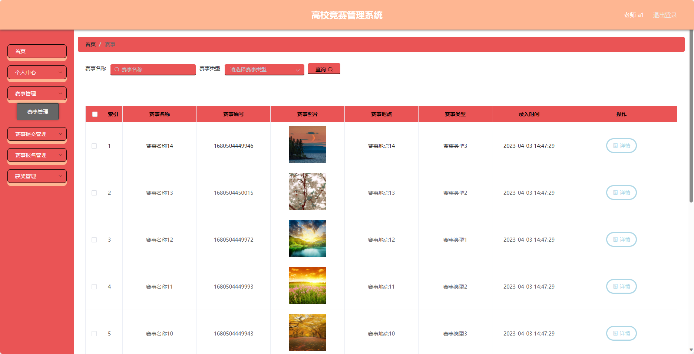
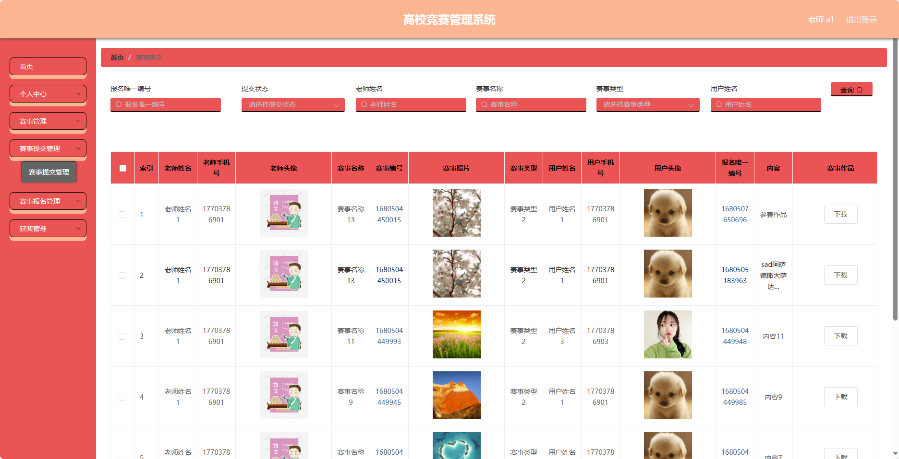

基于Springboot的高校竞赛管理系统（程序+论文）
=
### 完整代码获取地址：从戎源码网 ([https://armycodes.com/](https://armycodes.com/))
### 作者微信：19941326836  QQ：952045282 
### 承接计算机毕业设计、Java毕业设计、Python毕业设计、深度学习、机器学习
### 选题+开题报告+任务书+程序定制+安装调试+论文+答辩ppt 一条龙服务
### 所有选题地址https://github.com/nature924/allProject

一、项目介绍
---
基于Spring Boot框架实现的高校竞赛管理系统，系统包含四种角色：管理员、老师、专家、用户,系统分为前台和后台两大模块，主要功能如下。

## 前台：
1. 首页：展示竞赛相关信息和轮播图信息。
2. 论坛：提供用户之间交流讨论的平台。
3. 竞赛公告：展示竞赛的公告信息。
4. 获奖：展示竞赛获奖者和奖项信息。
5. 赛事：展示竞赛的详细信息，包括赛事规则、报名信息等。
6. 个人中心：用户可以管理个人信息，包括修改密码、查看个人资料等。

### 后台：
### 1. 老师：
   - 个人中心：管理个人信息，包括修改密码、查看个人资料等。
   - 赛事管理：管理赛事的信息，包括添加、编辑、删除赛事等操作。
   - 赛事提交管理：管理赛事提交的信息，包括审核、编辑、删除赛事提交等操作。
   - 赛事报名管理：管理赛事报名的信息，包括审核、编辑、删除赛事报名等操作。
   - 获奖管理：管理获奖的信息，包括添加、编辑、删除获奖等操作。

### 2. 专家：
   - 个人中心：管理个人信息，包括修改密码、查看个人资料等。
   - 评审管理：管理评审的信息，包括添加、编辑、删除评审等操作。
   - 赛事管理：管理赛事的信息，包括添加、编辑、删除赛事等操作。
   - 评审分配管理：管理评审分配的信息，包括添加、编辑、删除评审分配等操作。
   - 评审打分管理：管理评审打分的信息，包括添加、编辑、删除评审打分等操作。
   - 获奖管理：管理获奖的信息，包括添加、编辑、删除获奖等操作。

### 3. 管理员：
   - 个人中心：管理个人信息，包括修改密码、查看个人资料等。
   - 管理员管理：管理其他管理员的信息，包括添加、编辑、删除管理员账号等操作。
   - 用户管理：管理用户的信息，包括添加、编辑、删除用户账号等操作。
   - 老师管理：管理老师的信息，包括添加、编辑、删除老师账号等操作。
   - 专家管理：管理专家的信息，包括添加、编辑、删除专家账号等操作。
   - 评审管理：管理评审的信息，包括添加、编辑、删除评审等操作。
   - 赛事管理：管理赛事的信息，包括添加、编辑、删除赛事等操作。
   - 竟赛公告管理：管理竞赛公告的发布和编辑等操作。
   - 评审分配管理：管理评审分配的信息，包括添加、编辑、删除评审分配等操作。
   - 评审打分管理：管理评审打分的信息，包括添加、编辑、删除评审打分等操作。
   - 赛事提交管理：管理赛事提交的信息，包括审核、编辑、删除赛事提交等操作。
   - 赛事报名管理：管理赛事报名的信息，包括审核、编辑、删除赛事报名等操作。
   - 论坛管理：管理论坛的发布和编辑等操作。
   - 获奖管理：管理获奖的信息，包括添加、编辑、删除获奖等操作。
   - 基础数据管理：管理系统的基础数据，包括轮播图信息的添加、编辑、删除等操作。

二、项目技术
---
- 编程语言：Java
- 数据库：MySQL
- 项目管理工具：Maven
- 前端技术：VUE、HTML、Jquery、Bootstrap
- 后端技术：Spring、SpringMVC、MyBatis

三、运行环境
---
- 操作系统：Windows、macOS都可以
- JDK版本：JDK1.8以上都可以
- 开发工具：IDEA、Ecplise、Myecplise都可以
- 数据库: MySQL5.7以上都可以
- Tomcat：任意版本都可以
- Maven：任意版本都可以

四、运行截图
---
### 论文截图：

### 程序截图：

